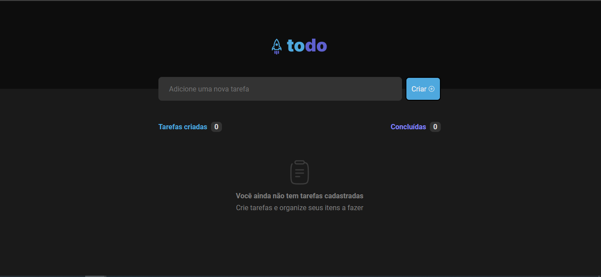
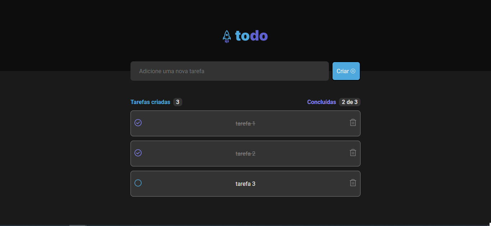

  

Ignite 2022 - Challenge: Practicing Concepts 🚀

<!-- 

Go check it out: <a href="https://feedget-4cttv6k9w-k4me.vercel.app/"> Feedget </a>

 -->
 
## 👀 Images

  

 

  

## 🔖 Layout

You can view the project layout through the link below:

- [ToDo List - Figma](<https://www.figma.com/file/5Qmv0GCERPXPx6pfYrnjxK/ToDo-List-(Copy)?node-id=0%3A1>)

Remembering that you need to have a [Figma](http://figma.com/) account to access it.

## 🚀 Technologies

- [ReactJS](https://reactjs.org/)
- [TypeScript](https://www.typescriptlang.org/)
- [Vitejs](https://vitejs.dev/)
- [Phosphor](https://phosphoricons.com/)
- [uuid](https://www.npmjs.com/package/uuid)

## 💻 Getting started

First, clone de project:

    git clone git@github.com:K4ME/Todo-List.git

Install the dependencies

    npm install

Run the code

    npm run dev

  Made with 💜 by <a href="https://www.linkedin.com/in/guilhermemacrini/">Guilherme Macrini</a>

